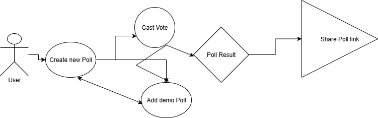

# 🗳️ Online Poll System Frontend

## Project Overview

This **Online Poll System** is a comprehensive web application built with **Next.js, TypeScript, Redux, and Tailwind CSS**, where users can create polls, vote, share and view live results. The system emphasizes **real-time updates**, **dynamic data visualizations**, and a smooth **user experience**.

---

## 🚀 Features
- ✅ **Poll Creation & Voting** – Create polls with multiple options and vote on active polls.
- 🔄 **Real-Time Results** – Results update live as votes are cast.
- 📊 **Dynamic Visualizations** – Charts display poll results in a clear and engaging way.
- 📱 **Responsive UI** – Optimized for mobile, tablet, and desktop.
- 🛡️ **Form Validation** – User-friendly error handling for invalid inputs.
- 🔄 **Share active Poll with others** - users can vote on active polls through shared links with others 

---

## 🛠️ Tech Stack
- **[Next.js](https://nextjs.org/)** – Component-based UI and server-side rendering.
- **[TypeScript](https://www.typescriptlang.org/)** – Type safety and maintainable code.
- **[Redux](https://redux.js.org/)** – Global state management.
- **[Tailwind CSS](https://tailwindcss.com/)** – Modern styling and responsive design.
- **[Recharts](https://recharts.org/en-US/)** or **[Chart.js](https://www.chartjs.org/)** – Dynamic data visualizations.

---

# 📊 Improvements

🌐 Deployed with Vercel.

📤 Shareable poll links with audience.

📈 Added charts for visualizing poll results.

## 👨‍💻 Author

### Developed by **Prince Takyi Amoako ✨**

 
---

# **Project Presentation**
**Online Poll system Wireframe**:

---
## **Product Presentation Slides link**
https://docs.google.com/presentation/d/1y1rJah3VV5XI-ShBQLhimaqKp_IVYCLxnQQ0QVP6mRc/edit?usp=sharing

## **Product Protoype Design link (Online Poll system)**
https://www.figma.com/design/3taaKc4MvGos2wZxUyXN0G/Untitled?node-id=0-1&t=yHfFNHnhjNejHPEd-1

